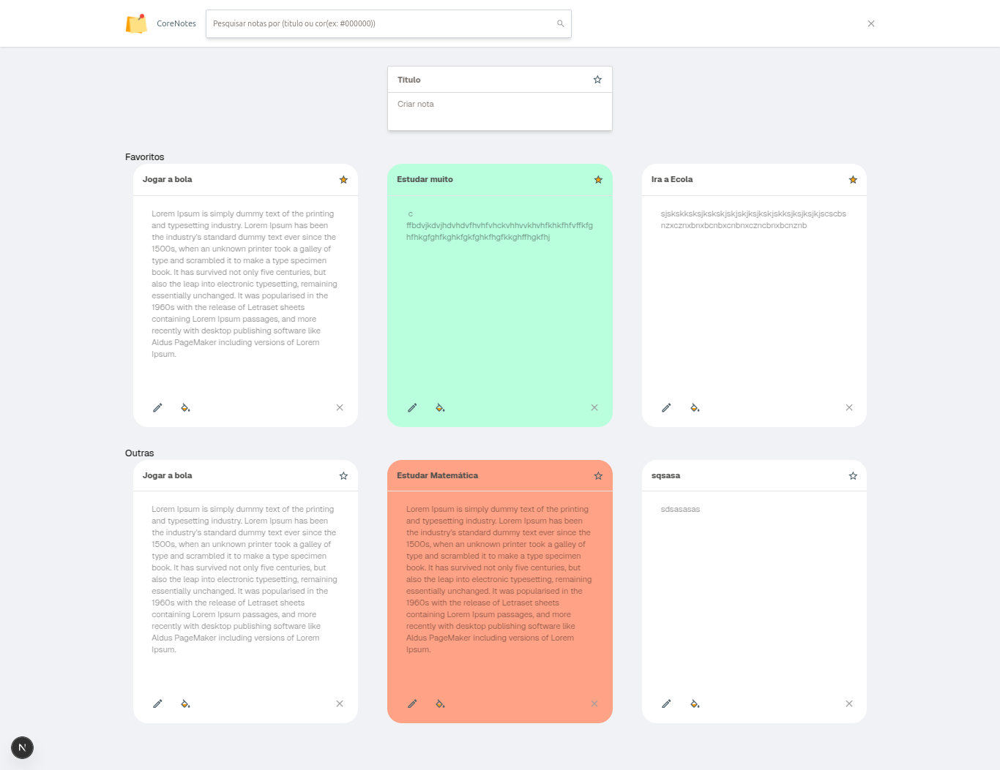

# 📌 Lista de tarefas

Gerencie suas tarefas de forma simples e eficiente com este sistema. Este projeto é composto por um frontend desenvolvido em React (NextJS) e um backend baseado em Node.js (AdonisJS).

---

## 🚀 **Funcionalidades**

### **Frontend**

- Interface limpa e responsiva
- Criação, leitura, atualização e exclusão de tarefas.
- Favoritos.
- Personalização de cores das tarefas.
- Filtragem por Titulo e core das tarefas.

### **Backend**

- API RESTful para gerenciamento das Tarefas.
- Suporte a operações de CRUD.

---

## 🛠️ **Tecnologias Utilizadas**

### **Frontend**

- **NextJs**
- **Tailwind CSS** para estilização.
- **Shadcn** para componentes.
- **React Hook Form & Zod** para formulários.
- **Axios** para consumo da API.
- **Zustand** para gerenciamento de Estados.
- **Typescript** para Tipagem.

### **Backend**

- **Node.js** com **AdonisJs**.
- **MYSQL** para banco de dados.

## ⚙️ **Pré-requisitos**

Certifique-se de ter instalado:

- **Node.js** >=22.x
- **PNPM** ou **NPM**.

## 🛠️ **Como Configurar o Projeto**

### **Backend**

1. Clone o repositório:

```bash
   git clone https://github.com/EvandroEusebio/APIBanc-ria.git
   cd back
```

2. Instale as dependencias

```bash
   npm install
```

3. Configure o arquivo config/config.json

```bash
"development":{
  "username": "NOME_DO_USUARIO_DO_SEU_BANCO (root)",
  "password": "SENHA_DO_SEU_BANCO (null)",
  "database": "NOME_DO_SEU_BANCO",
  "host": "ENDEREÇO_DO_SEU_BANCO (127.0.0.1)",
  "dialect": "mysql" }
```

4. Execute as migrações do banco

```bash
npx sequelize-cli db:migrate
```

5. Inicie o servidor

```bash
npm start
```

### **Frontend**

1. Clone o repositório:

```bash
   git clone https://github.com/EvandroEusebio/APIBanc-ria.git
   cd front/Pix-front
```

2. Instale as dependencias

```bash
   pnpm i
   ou
   npm install
```

3. Acesse o arquivo src/service/axios.ts e configure:

```bash
   const axiosInstance = axios.create({
  baseURL: "http://localhost:5000", // Insira sua url do servidor
  headers: {
    "Content-Type": "application/json",
  },
});
```

4. Inicie o projeto:

```bash
   pnpm run dev
```

🧪 Como Usar

- **Acesse o Frontend: http://localhost:5173.**
- **Crie uma conta e faça login.**
- **Gerencie suas transações PIX no painel.**

📖 Rotas da API

- **POST /users** Registra um novo usuário.
- **POST /users/login** Realiza login.
- **POST /users/pix** Envia um novo pix.
- **POST /users/pix/{id}** pega os pixs do usuário.
- **POST /users/pix/receive/{id}** pega os pixs recebidos do usuário.
- **POST /users/pix/send/{id}** pega os pixs enviados do usuário.

📝 Licença

Este projeto está sob a licença MIT. Consulte o arquivo LICENSE para mais informações.

📧 Contato

- **Email: ** eusebioevandro01@gmail.com
- **GitHub: ** https://github.com/EvandroEusebio
- **Linkedin: ** https://www.linkedin.com/in/evandro-eus%C3%A9bio-121a5a26a/
